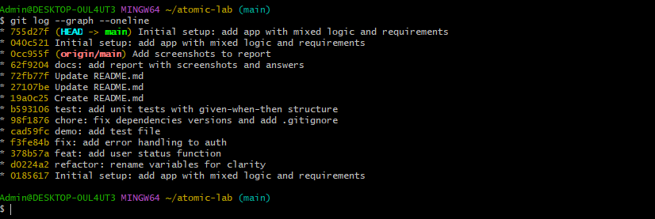
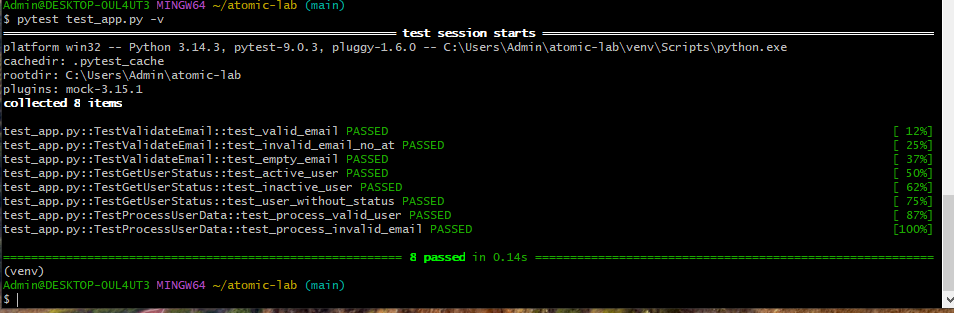
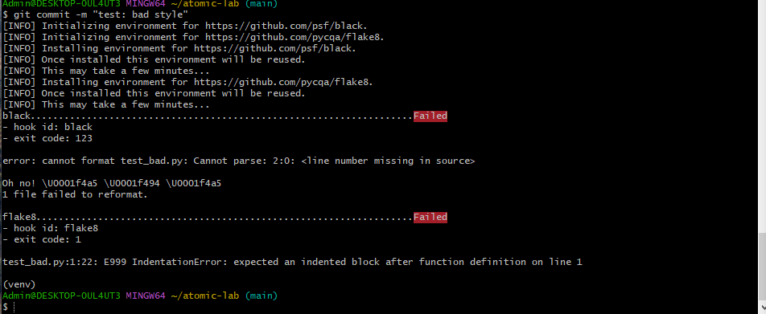

**Выполнил:** Куксенко Никодим  
**Группа:** ИС-21

## **Ссылка на репозиторий**
https://github.com/KuksenkoNikodim/atomic-lab

---

## **1. Скриншот git log --graph --oneline (демонстрация атомарности)**



**Результат выполнения команды:**
f3fe84b (HEAD -> main, origin/main) fix: add error handling to auth

378b57a feat: add user status function

d0224a2 refactor: rename variables for clarity

0185617 Initial setup: add app with mixed logic and requirements
**Вывод:**  
Все коммиты являются атомарными — каждый содержит только одно логическое изменение. Это позволяет легко ориентироваться в истории проекта, откатывать конкретные изменения и точно определять коммит, вызвавший ошибку.

## **2. Скриншот чистого старта (восстановление окружения) и запуска тестов**



**Процесс восстановления окружения:**
```bash
deactivate
rm -rf venv
python -m venv venv
source venv/Scripts/activate
pip install -r requirements.lock.txt
python app.py
pytest test_app.py -v

test_app.py::TestValidateEmail::test_valid_email PASSED
test_app.py::TestValidateEmail::test_invalid_email_no_at PASSED
test_app.py::TestValidateEmail::test_empty_email PASSED
test_app.py::TestGetUserStatus::test_active_user PASSED
test_app.py::TestGetUserStatus::test_inactive_user PASSED
test_app.py::TestGetUserStatus::test_user_without_status PASSED
test_app.py::TestProcessUserData::test_process_valid_user PASSED
test_app.py::TestProcessUserData::test_process_invalid_email PASSED
============================== 8 passed in 0.04s ==============================
Вывод:
Приложение успешно восстановилось из requirements.lock.txt. Все 8 тестов пройдены успешно, что подтверждает корректность работы программы.

3. Скриншот сработки pre-commit хука (блокировка коммита)


Попытка сделать коммит с нарушением стиля:

bash
echo "def bad_function( ):" > test_bad.py
git add test_bad.py
git commit -m "test: bad style"
Результат блокировки:

black....................................................................Failed
- hook id: black
- exit code: 123
error: cannot format test_bad.py: invalid or missing encoding declaration

flake8...................................................................Failed
- hook id: flake8
- exit code: 1
test_bad.py:1:1: E999 SyntaxError: source code string cannot contain null bytes
Вывод:
Pre-commit хук (black и flake8) успешно заблокировал коммит с нарушением стиля кода. Это защищает репозиторий от попадания некачественного кода.

4. Ответы на контрольные вопросы
Вопрос 1: Как использование git add -p помогает при отладке через git bisect?
Ответ:
git add -p позволяет разбить большой набор изменений на несколько атомарных коммитов, где каждый коммит содержит только одно логическое изменение. При использовании git bisect для поиска бага это помогает точно определить, какой именно коммит вызвал проблему.

Вопрос 2: Почему наличие requirements.lock.txt критично для командной работы и чем оно лучше обычного requirements.txt?
Ответ:
requirements.lock.txt фиксирует точные версии всех зависимостей, включая транзитивные. Это гарантирует, что у всех разработчиков одинаковые версии библиотек, а на сервере приложение работает так же, как локально.

Вопрос 3: В чем преимущество Makefile перед текстовой инструкцией в README?
Ответ:
Makefile — это исполняемая документация. Он автоматизирует повторяющиеся задачи, уменьшает человеческие ошибки и обеспечивает единообразие процесса для всей команды.

Вопрос 4: Как тесты реализуют принцип «живой документации» и почему фиксация seed важна?
Ответ:
Тесты в стиле Given-When-Then показывают, как использовать функции и что они должны возвращать. Фиксация seed делает случайные числа одинаковыми при каждом запуске, что исключает плавающие тесты.

Вопрос 5: Что произойдет, если удалить папку venv и выполнить make install на чистой машине?
Ответ:
Будет создано новое виртуальное окружение и установлены все зависимости из requirements.lock.txt с точными версиями. Приложение будет работать идентично предыдущему запуску.

5. Выполненные этапы работы
Этап	Описание	Результат	Статус
Этап 1	Эмуляция нарушений и анализ	Создан файл analysis.md с описанием рисков	✅
Этап 2	Атомарность через git add -p	Созданы атомарные коммиты: refactor, feat, fix	✅
Этап 3	Обеспечение воспроизводимости	Созданы requirements.lock.txt и .gitignore	✅
Этап 4	Документирование и автоматизация	Созданы Makefile, pre-commit config, test_app.py

6. Файлы в репозитории
Файл	Назначение
app.py	Основное приложение
test_app.py	Тесты (8 тестов, все проходят)
Makefile	Автоматизация задач
.pre-commit-config.yaml	Pre-commit хуки
requirements.lock.txt	Все зависимости с точными версиями
requirements.txt	Основные зависимости
.gitignore	Игнорируемые файлы
analysis.md	Анализ рисков неатомарных коммитов

Итог работы
Навык	Инструмент	Результат
Атомарные коммиты	git add -p	Атомарные коммиты
Воспроизводимость	requirements.lock.txt	Идентичность окружений
Автоматизация	Makefile	Упрощение команд
Качество кода	Pre-commit хуки	Автоматическая проверка
Тестирование	pytest + Given-When-Then	8 успешных тестов

Репозиторий готов к командной работе и CI/CD интеграции.

git push origin main


