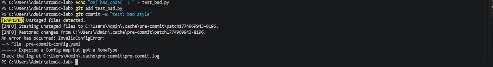
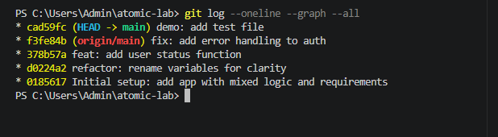
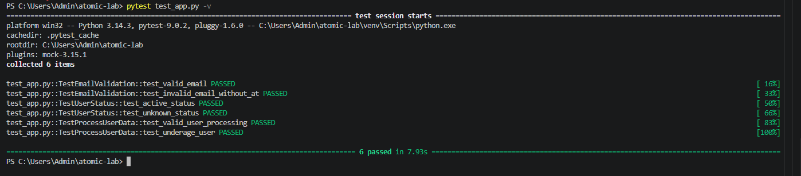
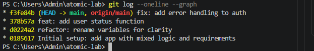

# Практическая работа: Локальный рабочий процесс

**Выполнил:** Куксенко Никодим студент группы ИС 21
**Дата:** 31.03.2026

---

## Скриншоты

### Скриншот 1: История коммитов (атомарность)

### Скриншот 2: Интерактивный стейджинг (git add -p)

### Скриншот 3: Полная история коммитов

### Скриншот 4: Чистый старт (тесты PASSED)

### Скриншот 5: Pre-commit hook (блокировка коммита)

---

## Ответы на контрольные вопросы

### 1. Как использование git add -p помогает при отладке через git bisect?

**Ответ:** `git add -p` позволяет создавать атомарные коммиты, где каждый коммит содержит только одно логическое изменение. Это помогает `git bisect` точно определить коммит, вызвавший ошибку, без лишних изменений, которые могут запутать процесс отладки.

### 2. Почему наличие requirements.lock.txt критично для командной работы?

**Ответ:** `requirements.lock.txt` фиксирует точные версии всех зависимостей, что обеспечивает идентичность окружений у всех разработчиков, исключая ситуацию "у меня работает, а у тебя нет". Это гарантирует воспроизводимость сборки и предсказуемость работы приложения.
**Ответ:** `git add -p` позволяет создавать атомарные коммиты, где каждый коммит содержит только одно логическое изменение. При использовании `git bisect` это позволяет точно определить коммит, вызвавший ошибку, без лишних изменений, которые могут запутать процесс отладки.

### 2. Почему наличие requirements.lock.txt критично для командной работы?

**Ответ:** `requirements.lock.txt` фиксирует точные версии всех зависимостей (включая транзитивные), что обеспечивает:
- Идентичность окружений у всех разработчиков
- Предсказуемость работы приложения
- Воспроизводимость сборки в CI/CD
- Устранение проблемы "у меня работает, а у тебя нет"

### 3. В чем преимущество Makefile перед текстовой инструкцией в README?

**Ответ:** Makefile является исполняемой документацией. Вместо копирования команд из README, разработчики просто выполняют `make install`, `make test` и т.д. Это исключает ошибки ручного ввода, автоматизирует сложные процессы и обеспечивает единообразие выполнения операций.

### 4. Как тесты реализуют принцип «живой документации» и почему фиксация seed важна?

**Ответ:** Тесты демонстрируют, как должны использоваться функции (примеры), всегда актуальны и проверяются автоматически. Структура Given-When-Then документирует предусловия, действия и ожидаемые результаты.

Фиксация seed (`random.seed(42)`) важна для детерминированности тестов — они дают одинаковый результат при каждом запуске, что позволяет воспроизводить ошибки и обеспечивает стабильность CI/CD.

### 5. Что произойдет при удалении venv и выполнении make install?

**Ответ:** При выполнении `make install` на чистой системе будет создано новое виртуальное окружение, установятся зависимости из `requirements.lock.txt` с точными версиями. Результат будет полностью идентичен исходному окружению, что демонстрирует полную воспроизводимость
**Ответ:** Тесты демонстрируют, как должны использоваться функции (примеры использования), всегда актуальны и проверяются автоматически. Структура Given-When-Then документирует предусловия, действия и ожидаемые результаты.

Фиксация seed (`random.seed(42)`) важна для:
- Детерминированности тестов (одинаковый результат при каждом запуске)
- Воспроизводимости ошибок
- Стабильности CI/CD (отсутствие flaky tests)

### 5. Что произойдет при удалении venv и выполнении make install?

**Ответ:** При выполнении `make install` на чистой системе:
1. Будет создано новое виртуальное окружение
2. Установятся зависимости из `requirements.lock.txt` с точными версиями
3. Результат будет полностью идентичен исходному окружению
4. Все тесты будут проходить успешно

Это демонстрирует полную воспроизводимость окружения.

---

## Ссылка на репозиторий

[https://github.com/KuksenkoNikodim/atomic-lab](https://github.com/KuksenkoNikodim/atomic-lab)

---

## Вывод

В ходе практической работы были выполнены все этапы:
- 1 Созданы атомарные коммиты с использованием git add -p
- 2 Обеспечена воспроизводимость через requirements.lock.txt
- 3 Созданы тесты с фиксацией seed
- 4 Настроены pre-commit хуки для автоматической проверки кода
- 5 Создан Makefile для автоматизации процессов
- 6 Созданы атомарные коммиты
- 7 Обеспечена воспроизводимость через requirements.lock.txt
- 8 Созданы тесты с фиксацией seed
- 9 Настроены pre-commit хуки
- 10 Создан Makefile для автоматизации

